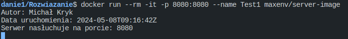
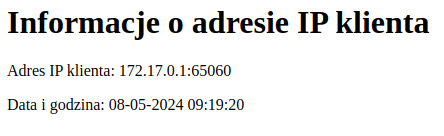
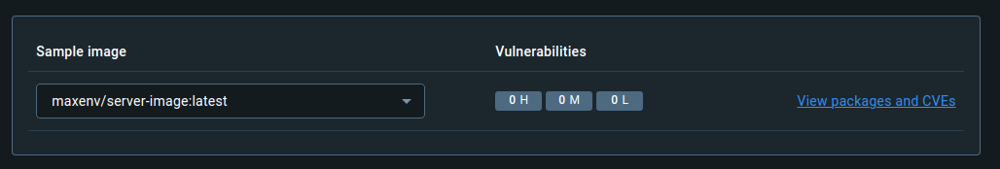
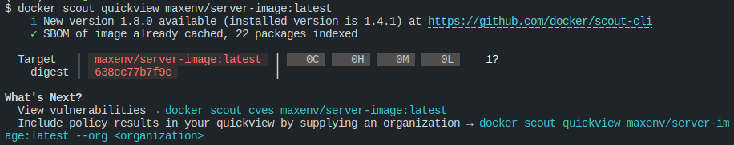
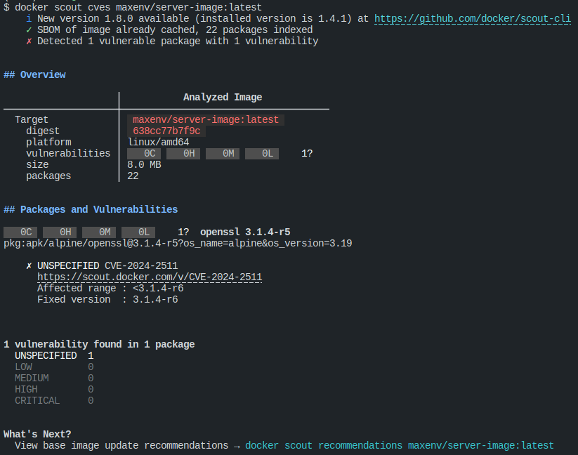

Multistage building of simple application shows IP addres and current time in Warsaw.
The goal is to build lightest weight image.

You can find the image on [DockerHub repository](https://hub.docker.com/repository/docker/maxenv/server-image/general)

# Versions

There are three versions of dockerfile:

1. default Dockerfile - based on alpine and contains HEALTHCHECK
2. Dockerfile_selfTest - based on scratch and contains HEALTHCHECK test wrote in goLang
3. Dockerfile_minimal - this is the lightest but don't have any HEALTHCHECK, only the app

# Start container

docker run --rm -it -p 8080:8080 --name Test1 maxenv/server-image

# Exercise 3

## a. Build container

### Create new builder

Use the following command to create a new builder:

```bash
docker buildx create --use --name mybuilder --driver docker-container --bootstrap
```

### Build container using the builder

Use the following command to build the container:

```bash
docker buildx build -t local/server-image .
```

### Command which I use

I use this command to build the Docker image for multiple platforms and push it to Docker Hub:

```bash
docker buildx build --sbom=true --provenance=mode=max --platform linux/amd64,linux/arm64 --cache-from=type=registry,ref=maxenv/server-image:latest --cache-to=type=registry,ref=maxenv/server-image:cache,mode=max --push -t maxenv/server-image:latest .
```

## b. run conainer on build image

### Run container from local build image

```bash
docker run --rm -it -p 8080:8080 --name Test1 local/server-image
```

### Run container from dockerhub

```bash
docker run --rm -it -p 8080:8080 --name Test1 maxenv/server-image
```

## c. Retrieving Information from the Server

After running the container, you can retrieve information from the server in your terminal and by visiting http://localhost:8080 in your web browser.

<p>

Screen from terminal<br>


Screen from website<br>


</p>

## d. Check image layers

```bash
docker history maxenv/server-image
```

or for localbuild

```bash
docker history local/server-image
```

# Scout Vulnerabilities

## Commands to check vulnerabilities

```bash
docker scout quickview maxenv/server-image:latest
```

```bash
docker scout cves maxenv/server-image:latest
```

## Screenshots






